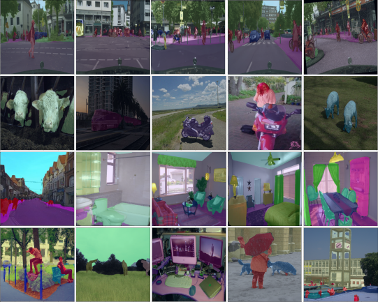
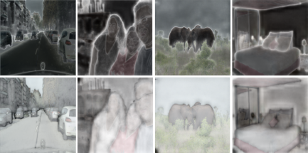
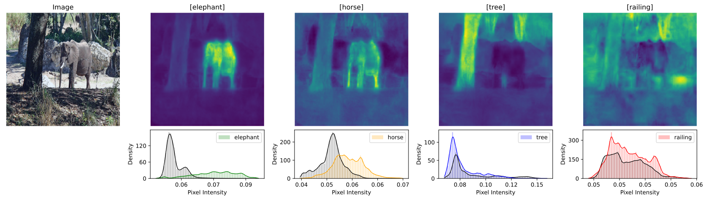
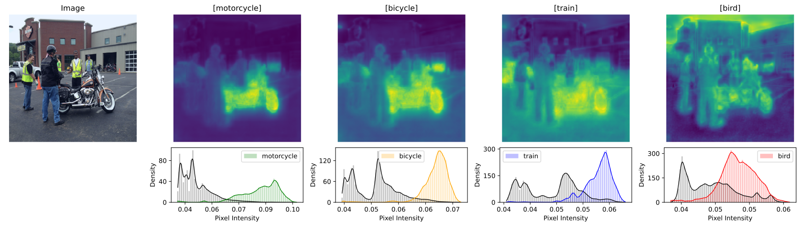
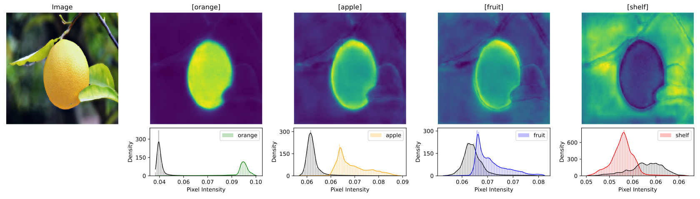
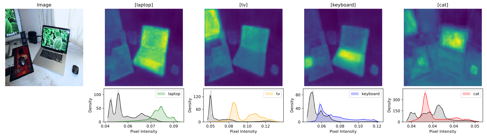

# Lorentz Entailment Cone for Semantic Segmentation

**Official PyTorch Implementation**

This is a PyTorch/GPU implementation of the paper [Lorentz Entailment Cone for Semantic Segmentation]()

```
@inproceedings{zahid2026lorentz,
  title={Lorentz Entailment Cone for Semantic Segmentation},
  author={Hasan, Zahid and Ahmed, Masud and Roy, Nirmalya},
  booktitle={2026 IEEE/CVF Winter Conference on Applications of Computer Vision (WACV)},
  pages={},
  year={2026},
  organization={IEEE}
}
```


## Abstract
Semantic segmentation in hyperbolic space can capture hierarchical structure in low dimensions with uncertainty quantification. Existing approaches choose the Poincaré ball model for hyperbolic geometry, which suffers from numerical instabilities, optimization, and computational challenges. We propose a novel, tractable, architecture-agnostic semantic segmentation framework in the hyperbolic Lorentz model. We employ text embeddings with semantic and visual cues to guide hierarchical pixel-level representations in Lorentz space. This enables stable and efficient optimization without requiring a Riemannian optimizer, and easily integrates with existing Euclidean architectures. Beyond segmentation, our approach yields free uncertainty estimation, confidence map, boundary delineation, hierarchical and text-based retrieval,  and zero-shot performance, reaching generalized flatter minima. We further introduce a novel uncertainty and confidence indicator in Lorentz cone embeddings. Extensive experiments on ADE20K, COCO-Stuff-164k, Pascal-VOC, and Cityscapes with state-of-the-art models (DeepLabV3 and SegFormer) validate the effectiveness and generality of our approach. Our results demonstrate the potential of hyperbolic Lorentz embeddings for robust and uncertainty-aware semantic segmentation.

## 🎥 Video Presentation

**Presentation in WACV Conference 2026**

<p align="center">
  <a href="https://www.youtube.com/watch?v=vXwpx6WwQ2A">
    
  </a>
</p>

## Live Demo

<p align="center">
  <a href="https://coneimage.com/">
    
  </a>
</p>

<p align="center">
  <a href="https://coneimage.com/">
    
  </a>
</p>

<p align="center">
  <a href="https://coneimage.com/">
    
  </a>
</p>

## Result
Qualitative segmentation results across Cityscapes, Pascal-VOC (DeepLabV3), ADE20K, and COCO-Stuff test samples
<p align="center">
  
</p>

Uncertainty maps across Cityscapes, Pascal-VOC, COCO-Stuff, and ADE20K datasets (columns). The first row shows angle-based uncertainty, while the second row shows length-based uncertainty.
<p align="center">
  
</p>

Image mask captured by different keywords. We point to the corresponding histogram; the accurate class text has the highest confidence, and so on (more results in the supplementary section).
<p align="center">
  <table>
      <tr>
        <td align="center"><br>Elephant</td>
        <td align="center"><br>Motorcycle</td>
      </tr>
      <tr>
        <td align="center"><br>Orange</td>
        <td align="center"><br>Laptop</td>
      </tr>
  </table>
</p>

## Prerequisite
To install the docker environment, first edit the `docker_env/Makefile`:
```
IMAGE=img_name/dl-aio
CONTAINER=containter_name
AVAILABLE_GPUS='0,1'
LOCAL_JUPYTER_PORT=17001
LOCAL_TENSORBOARD_PORT=17002
PASSWORD=yourpassword
WORKSPACE=workspace_directory
```
- Edit the `img_name`, `containter_name`, `available_gpus`, `jupyter_port`, `tensorboard_port`, `password`, `workspace_directory`

1. For the first time run the following commands in terminal:
```
cd docker_env
make docker-build
make docker-run
```
2. or further use to docker environment
- To stop the environmnet: `make docker-stop`
- To resume the environmente: `make docker-resume`

For coding open a web browser `ip_address:jupyter_port` e.g.,`http://localhost:17001`

## Dataset
Four Dataset is used in the work
1. [Cityscapes Dataset](https://www.cityscapes-dataset.com/)
2. [Pascal-VOC](https://datasetninja.com/pascal-voc-2012)
3. [ADE20K](https://ade20k.csail.mit.edu/)
4. [COCO-Stuff](https://github.com/nightrome/cocostuff?tab=readme-ov-file)

## Weights

## Validation

## Training

## Acknowlegement
